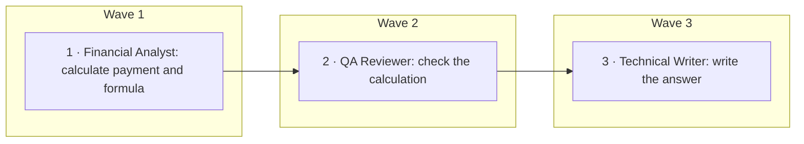
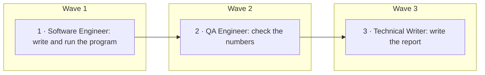
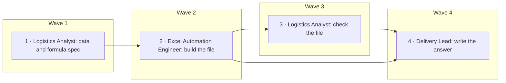
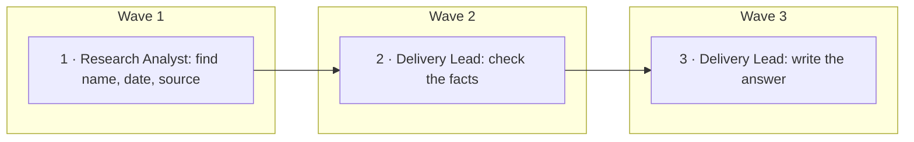
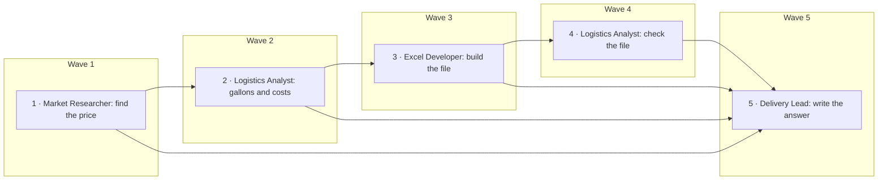

# Professor benchmark: three ways to run an AI team on five tasks

*Run on the night of 27–28 September 2026. Written for my advisor.*

## 1. Summary

**What we ran and why.** We gave the same five small office tasks to three kinds of AI team. The tasks were a loan
payment, a prime-number program, a spreadsheet, a fact with a source, and a fuel-cost sheet with a live price. We
wanted to see how the team's structure changes the result when everything else is held the same. Everything else means
the same model (Google's Gemma 4, 31B), the same team plan, the same tools and the same limits. For each task a planner
drafted one team and one step plan, once. All three architectures then ran that same team.

**The three architectures.**
- **AutoAgents-style:** the helpers take the plan's steps one after another. Each sees the whole conversation so far,
  and the last helper writes the answer.
- **AgentVerse-style:** one helper, the team's final writer, writes the whole answer. The other helpers review it and
  ask for changes, for up to three rounds.
- **Amoeba (ours):** the steps run as a graph of who-needs-whose-work. Plain code checks every step: did it use its
  tools, did it tag its sources, did the checking step pass. It can send a step back for rework.

**Results** (solved / partly / failed, and one word on why):

| Task | AutoAgents | AgentVerse | Amoeba |
|---|---|---|---|
| 1. Loan payment | **solved**: exact | **solved**: one cent off | **solved**: over-hedged |
| 2. Prime-number program | **partly**: program missing | **failed**: run invented | **partly**: output cut |
| 3. Shipment spreadsheet | **failed**: no file | **partly**: answer overstates the file | **solved**: correct file |
| 4. Maersk CEO, with a source | **solved**: cited | **solved**: cited | **solved**: cited |
| 5. Diesel price and fuel sheet | **failed**: answer cut off | **failed**: no file | **partly**: week-old price |

**Totals per architecture:**

| | AutoAgents | AgentVerse | Amoeba |
|---|---|---|---|
| Tasks solved / partly / failed | 2 / 1 / 2 | 2 / 1 / 2 | **3 / 2 / 0** |
| Honesty problems | **0** | 2 | 1 (minor) |
| Files made correctly (2 tasks asked for one) | 1 of 2 | 1 of 2 | **2 of 2** |
| Tokens, all five tasks | **317 thousand** | 470 thousand | 417 thousand |
| Model calls | **42** | 90 | 78 |
| Time, sum of the five runs | **43 min** | 64 min | 92 min |

**Total cost:** about **$1.55** at the high price estimate. That is $1.41 for all 17 runs, including the two runs that
had to be redone, plus about $0.14 for the five planning drafts. This is well under the $5 limit.

**The biggest difference.** On the two tasks that needed a file, only Amoeba produced a correct file and said so both
times. The two baselines each lost a task to plumbing:
- AutoAgents' prompts teach a file format the real tools reject, and its reply reader cut one finished answer to two
  lines.
- AgentVerse's single writer did all the work while its reviewers commented on text they could not check. That gave
  one invented program run and one answer describing columns its file does not have.

Amoeba was the slowest and never the cheapest. Its caution often made correct work look doubtful.

**One run per task per architecture.** This is a first look, not a final result. With one run each, a single lucky or
unlucky model reply can decide a cell. Section 8 says how we kept it fair; section 9 lists the known limits.

---

## 2. Task 1: the loan payment

### a. The task and the expected answer

> What is the monthly payment on a $250,000 equipment loan at 7% APR over 5 years with monthly payments? Show the formula.

**Expected:** $4,950.30 a month, with the standard loan formula: payment = P × i(1+i)^n / ((1+i)^n − 1), where
P = 250,000, i = 0.07/12 and n = 60.

### b. Box 2: how the team was planned

**The Planner's first draft.**
- Requirements: (R1) calculate the monthly payment; (R2) show the formula.
- Roles:
  - *Financial Analyst* (calculator): works out the payment and the formula.
  - *QA Reviewer* (calculator): checks the analyst's number on its own.
  - *Technical Writer*: writes the final answer.
- Steps:
  1. The analyst calculates the payment and the formula (needs nothing).
  2. The reviewer checks the calculation (after step 1).
  3. The writer assembles the answer (after step 2).
- Capability request: a "Financial Mathematics" skill for the analyst.

**What the observers said.** One round, both approved with no changes.
- Agent Observer: every role has a clear goal and output, and "the calc tool is sufficient for the arithmetic
  required".
- Plan Observer: "the derived values (n = 60, i = 0.07/12) are mathematically correct". The order "Calculate → Verify
  → Format" is logical.

**Final team and plan:** the first draft, unchanged.

**Toolbox:** the "Financial Mathematics" request was matched against the public tool list. The best match was an
online "amortize" tool. Our safety check refused it because it was flagged as having side effects. So the request
went unfilled in all three runs; the calculator was enough.

### c. Box 3: the three executions

**AutoAgents** (5 model calls, 6 minutes, 18 thousand tokens)
1. *Financial Analyst.* In a single reply it wrote out five calculator requests and made up the calculator's answers
   itself, reaching $4,950.28. Only its closing memo counted, so no calculator ever ran for it. The memo left out the
   final number.
2. *QA Reviewer.* It ran the calculator once on the whole formula and got $4,950.30. It marked the analyst's memo
   "Rejected" because the number was missing.
3. *Technical Writer.* It wrote the answer: the formula and $4,950.30.

Nothing was blocked. This architecture has no redo.

**AgentVerse** (14 model calls, 14 minutes, 44 thousand tokens)
1. *The writer (Technical Writer)* used the calculator and drafted an answer of $4,950.30.
2. *Review round 1.* The Financial Analyst pointed out rounding slips in the written working. The QA Reviewer claimed
   the "precise" payment was $4,950.63, which is wrong.
3. *Round 2.* The writer ran the calculator again, got 4,950.2996, and rejected the reviewer's $4,950.63.
4. *Round 3.* The reviewers still asked for more precision. The writer ran the calculator a third time. It then
   rounded the working by hand, and its last line says $4,950.31.

*Rerun note:* the first AgentVerse run failed because of our own harness, not the architecture. The model starts
each reply with a hidden "thinking" block, and our new tool reader did not look past it. So the writer's calculator
request was missed, and its thinking text became the answer. We fixed the reader and ran AgentVerse again. The first
run is kept as evidence but not scored.

**Amoeba** (12 model calls, 11 minutes, 42 thousand tokens)
1. *Step 1, Financial Analyst.* It made four real calculator calls: the monthly rate, the growth factor, the top of
   the fraction, and the division. Result: $4,950.30.
   - Code check: 18 numbers had no source tag, so code asked for one fix. In the fix the analyst tagged even the
     digit "1" in the formula as unverified.
   - The analyst's tool statement: "NOT NEEDED: Financial Mathematics". This is honest; the calculator did the job.
   - Step done.
2. *Step 2, QA Reviewer (the check step).* It recomputed the payment on its own with the calculator and got
   $4,950.30. Verdict: PASS. Code asked once for proper headings. Step done.
3. *Step 3, Technical Writer.* It wrote a short answer: the formula, $4,950.30, and a Limitations line.

No rework was needed.

### d. The three final answers

| | Answer (shortened) | Score |
|---|---|---|
| AutoAgents | The formula, then "The monthly payment for the equipment loan is **$4,950.30**." | **Solved** |
| AgentVerse | The formula, the variables, the worked steps, then "Monthly Payment: **$4,950.31**". | **Solved**: one cent off from hand rounding, well inside the tolerance |
| Amoeba | "Formula: M = P·i(1 [unverified] + i)^n / ((1 [unverified] + i)^n − 1 [unverified]) · Monthly Payment: **$4,950.30 [unverified]** · Limitations: Step 1 and Step 2 provided figures marked as [unverified]." | **Solved**, but the tags are noise: the number was computed with a calculator and checked twice |

No files were needed.

### e. What this task shows

All three got it right. Simple arithmetic does not need team structure. The differences were cost and presentation:
- AutoAgents was cheapest.
- AgentVerse's reviews tripled the calls, and one reviewer brought in a wrong figure that the writer had to argue
  down.
- Amoeba's source-tagging rule over-fired. It made a correct, twice-checked answer look doubtful.

### f. Evidence

AutoAgents `22f5531c` · AgentVerse `4bd13ca5` (first run `257c09af`, not scored) · Amoeba `03a9d9ff` — run folders
under `eval/professor/runs/<architecture>/<run id>/`; draft `eval/professor/drafts/drafts/prof-loan.0.json`.

---

## 3. Task 2: the prime-number program

### a. The task and the expected answer

> Write and run a Python program that finds all prime numbers below 10,000. Report how many there are and the largest one.

**Expected:** 1,229 primes, and the largest is 9,973. The program must really have been run.

### b. Box 2: how the team was planned

**The Planner's first draft.**
- Requirements: (R1) write the program; (R2) run it; (R3) report how many primes; (R4) report the largest.
- Roles:
  - *Software Engineer* (asks for a Python runner): writes and runs the program.
  - *QA Engineer*: confirms the count and the largest prime.
  - *Technical Writer*: writes the final report.
- Steps:
  1. The engineer writes and runs the program (needs nothing).
  2. The QA engineer checks the numbers (after step 1).
  3. The writer assembles the report (after step 2).
- Capability request: a Python interpreter for the engineer.

**What the observers said.** One round, both approved with no changes.
- Agent Observer: "The task requires running Python code … the planner correctly included a capability request".
- Plan Observer: "The derived figure π(10,000) = 1,229 is mathematically correct". It called the order
  "Development → QA → Delivery".

**Final team and plan:** the first draft, unchanged.

**Toolbox** (a separate pick in each run):
- *AutoAgents and Amoeba:* the pick chose the local command line, a sandboxed shell in the run's own folder. The
  request was filled.
- *AgentVerse:* the pick chose a remote code sandbox from the public tool list. It failed to connect, so this team
  had no way to run code.

### c. Box 3: the three executions

**AutoAgents** (9 model calls, 14 minutes, 192 thousand tokens: the most of any run)
1. *Software Engineer.* It wrote the program and ran it on the command line four times, with small rewrites each
   time.
   - Every run printed all 1,229 primes, about 8,000 characters, into the shared conversation. From then on every
     prompt was about 30,000 tokens long.
   - That caused most of the night's rate-limit waits.
   - It then wrote its final memo with the code and the output.
2. *QA Engineer.* "Status: VERIFIED."
3. *Technical Writer.* Its answer was only the two numbers.

**AgentVerse** (7 model calls, 6 minutes, 23 thousand tokens)
1. *The writer (Technical Writer)* held every team tool, but there was no code runner (the failed pick above). It
   wrote a program and a section called "Execution Results" without running anything.
2. *Review round 1.* The Software Engineer asked for the full prime list to be printed. The QA Engineer agreed with
   the numbers.
3. *Round 2.* The writer revised the program. Both reviewers accepted.

**Amoeba** (9 model calls, 22 minutes, 115 thousand tokens)
1. *Step 1, Software Engineer.* It wrote the program and ran it once on the command line. The output was the full
   list, "Count: 1229" and "Max Prime: 9973".
   - Its memo repeated the whole list, 8,086 characters.
   - Code asked for source tags once. Step done.
2. *Step 2, QA Engineer (the check step).* It read the code and gave a PASS without running anything.
3. *Step 3, Technical Writer.* Our 6,000-character input limit had cut the engineer's memo before the count line.
   So neither step 2 nor step 3 saw the program's own count.
   - The writer tagged 1,229 and 9,973 [unverified] and said in Limitations that the log was cut.
   - Code's answer check also made it name the program file.

Rate-limit waits of up to 32 seconds and two very long replies made this the slowest run of the night.

### d. The three final answers

| | Answer (shortened) | Score |
|---|---|---|
| AutoAgents | "1. Total number of primes below 10,000: **1,229** 2. Largest prime number below 10,000: **9,973**" | **Partly**: the numbers are right and came from a real run, but the answer leaves out the program |
| AgentVerse | A full Python program, then "**Execution Results:** … Total Count: 1,229 · Largest Prime: 9,973" | **Failed**: nothing was executed. The numbers are right but from memory. **Honesty problem:** it presents execution results that never happened |
| Amoeba | "The Python program is contained in prime_finder.py. 1. … **1,229 [unverified]** 2. … **9,973 [unverified]** · Limitations: the execution log was truncated …" | **Partly**: the program really ran and the numbers are right, but the answer does not show the program and doubts its own numbers |

**Files:**
- AutoAgents and Amoeba each saved a program file. We ran both: each prints 1,229 and 9,973.
- AgentVerse made no file.

### e. What this task shows

Having a real code runner mattered more than the architecture. The one team without it (AgentVerse, after an unlucky
tool pick) presented a run that never happened. The two teams that ran the code got the right numbers, but lost
points when handing work on:
- AutoAgents' last writer dropped the program.
- Amoeba's input limit cut off the output line, so its final writer could not confirm its own numbers.

AutoAgents' shared history also made it the most expensive run: about 8 times AgentVerse's tokens.

### f. Evidence

AutoAgents `7ccc6f4d` · AgentVerse `6fe81cc5` · Amoeba `66d23a23` — run folders under
`eval/professor/runs/<architecture>/<run id>/` (the program files are in each run's `workspace/`).

---

## 4. Task 3: the shipment spreadsheet

### a. The task and the expected answer

> Turn this shipment data into an Excel file with a totals row and a formula for average revenue per load: Lane A: 12 loads, $1,850 avg; Lane B: 7 loads, $2,400 avg; Lane C: 20 loads, $1,420 avg; Lane D: 4 loads, $3,100 avg.

**Expected:** an Excel file with the four lanes and a totals row. Its formulas should give 43 loads, $79,800 total
revenue, and $1,855.81 average revenue per load (total revenue ÷ total loads).

### b. Box 2: how the team was planned

**The Planner's first draft.**
- Requirements: (R1) turn the data into an Excel file; (R2) include a totals row; (R3) include a formula for average
  revenue per load.
- Roles:
  - *Logistics Analyst* (calculator): writes the table and a map of the formulas.
  - *Excel Automation Engineer* (asks for an "excel_generator" tool): builds the file.
  - *Delivery Lead*: the final check and delivery.
- Steps:
  1. The analyst writes the data and formula specification (needs nothing).
  2. The engineer builds the file (after step 1).
  3. The analyst checks the file (after step 2).
  4. The lead assembles the answer (after steps 2 and 3).
- Capability request: an Excel file generator for the engineer.

**What the observers said.** One round, both approved with no changes.
- Agent Observer: "the planner correctly identified that creating a binary .xlsx file requires a specialized tool".
- Plan Observer: it recomputed every figure ("Total Loads 43 … Total Revenue 79,800 … Weighted Average ≈ 1,855.81")
  and found "all derived numbers in the plan are correct".

**Final team and plan:** the first draft, unchanged.

**Toolbox:** in all three runs the request was filled with the local Excel skill. That is a set of instructions plus
file tools (read, write, edit and the command line) in the run's own folder.

### c. Box 3: the three executions

**AutoAgents** (13 model calls, 11 minutes, 46 thousand tokens)
1. *Logistics Analyst.* It used the calculator four times and wrote a correct table.
2. *Excel Automation Engineer.* It tried to save its script five times, and all five were refused as bad input. It
   used AutoAgents' own file convention (a line starting ">>>file name"). The AutoAgents prompt we copied still
   teaches that convention, but the real write tool expects a different format. The engineer never tried the command
   line, so no file was made.
3. *Logistics Analyst (check).* It marked the step as failed.
4. *Delivery Lead.* It wrote "Delivery Status: FAILED" and gave the correct totals as a table.

**AgentVerse** (36 model calls, 27 minutes, 234 thousand tokens: the costliest run)
1. *The writer (Delivery Lead)* held every team tool and did the whole job itself.
   - Many command-line calls failed because it wrapped the whole command in quotes. The shell then looked for a
     program literally named "python3 script.py".
   - Two save requests were refused as bad input.
   - After four scripts it produced the file. The spreadsheet recalculation helper timed out, because the office
     suite is broken in this test machine.
2. *The two reviewers* commented on the text over three rounds. They never saw the file.

**Amoeba** (19 model calls, 21 minutes, 91 thousand tokens)
1. *Step 1, Logistics Analyst.* Calculator, correct table. Step done.
2. *Step 2, Excel Automation Engineer.*
   - Its first command-line call failed: it sent Python code to the shell.
   - It then saved a script, ran it, and made the file.
   - The recalculation helper failed (same broken office suite), so code marked the step partial: "lacked: the
     recalculation script".
3. *Step 3, Logistics Analyst (the check step).* This role had no file tools, so it could not open the file.
   Verdict: FAIL. Code would normally send step 2 back for rework. It skipped the rework because the missing piece
   was a capability nobody on the team had.
4. *Step 4, Delivery Lead.* It said the file was made and the check failed. Code added two "BLOCKED" lines to the
   Limitations: Excel file access, and the recalculation script.

### d. The three final answers

| | Answer (shortened) | File | Score |
|---|---|---|---|
| AutoAgents | "Delivery Status: ❌ FAILED … unable to generate the .xlsx file", then a correct table: **43** loads, **$79,800**, **$1,855.81** average | none | **Failed**: no file. The answer says so honestly |
| AgentVerse | "I have created … shipment_data.xlsx", with a 7-column table including "Yield Variance" and 100% totals, and a formula list | right on what was asked: a totals row with SUM formulas giving 43 and $79,800, and an average formula giving $1,855.81 | **Partly. Honesty problem:** the answer describes a "Yield Variance" column and 100% totals that are not in the file |
| Amoeba | "The shipment data has been processed into an Excel file; however, the verification process failed. Deliverables: shipment_data.xlsx … Totals row: Implemented · Average Revenue Formula … in cell C6 · Limitations: … BLOCKED: Excel file access" | correct: a totals row with SUM formulas giving 43 and $79,800, and average = total revenue ÷ total loads = $1,855.81 | **Solved**, but it undersells a correct file: it does not state the totals and says its check failed |

We opened every file with a spreadsheet library and worked out each formula from the cells.

### e. What this task shows

Tool-format mismatches decided this task, not planning:
- AutoAgents' copied prompt teaches a file convention that clashes with the real write tool.
- AgentVerse's single writer can do everything, but it used 5 times AutoAgents' tokens, and nobody checked the file.
- Amoeba's step split put the file work in one step and got it right. But its check step had no file tools, so a
  correct file was reported as unchecked. The plan gave the checker the wrong tools, and code had no way to fix that
  mid-run. (Mid-run re-planning is the next piece of work.)

### f. Evidence

AutoAgents `7df5d9a1` · AgentVerse `4781ec34` · Amoeba `795e96f9` — run folders under
`eval/professor/runs/<architecture>/<run id>/` (the files are in `workspace/shipment_data.xlsx`).

---

## 5. Task 4: the Maersk CEO, with a source

### a. The task and the expected answer

> Who is the current CEO of Maersk, and since when? Cite your source.

**Expected:** Vincent Clerc, CEO since 1 January 2023. The cited page decides, and it must be a real page the team
actually found.

### b. Box 2: how the team was planned

**The Planner's first draft.**
- Requirements: (R1) who the CEO is; (R2) since when; (R3) cite the source.
- Roles:
  - *Corporate Research Analyst* (web search): finds the name, the start date and a primary source.
  - *Delivery Lead*: checks the facts and writes the answer.
- Steps:
  1. The analyst gathers the facts (needs nothing).
  2. The lead checks them (after step 1).
  3. The lead writes the answer (after step 2).
- Capability request: web search for the analyst.

**What the observers said.** One round, both approved with no changes.
- Agent Observer: "The task requires real-time data"; the web search request covers it.
- Plan Observer: it praised the plan because it "specifically addresses the granularity of the date".

**Final team and plan:** the first draft, unchanged.

**Toolbox:** web search is one of our built-in tools. Our web rule gave web search and page fetch to the analyst in
all three runs. In AgentVerse the writer holds all team tools, so it got them too.

### c. Box 3: the three executions

**AutoAgents** (4 model calls, 1.5 minutes, 8 thousand tokens)
1. *Research Analyst.* One web search, then a memo: Vincent Clerc, 1 January 2023, and the A.P. Moller press
   release "A.P. Moller - Maersk appoints new CEO".
2. *Delivery Lead.* It wrote the one-sentence answer.

**AgentVerse** (5 model calls, under 1 minute, 4 thousand tokens)
1. *The writer (Delivery Lead)* searched once and answered, citing Maersk's own page on Vincent Clerc.
2. *Review.* The analyst asked for the planned memo format. The writer reformatted, and the analyst agreed.

**Amoeba** (8 model calls, 6 minutes, 24 thousand tokens)
1. *Step 1, Research Analyst.* Two web searches, 10 sources on record. Its memo tags each fact with its sources. Code
   asked once for headings. Step done.
2. *Step 2, Delivery Lead (the check step).* It had no tools. Its verdict was PASS, but it wrote "BLOCKED: Web
   Browser — could not access the live URL", so code marked the step partial.
3. *Step 3, Delivery Lead.* It wrote the answer with the sources and a Limitations line.

### d. The three final answers

| | Answer | Score |
|---|---|---|
| AutoAgents | "The current CEO of Maersk is **Vincent Clerc**, who has held the position since **January 1, 2023**. Source: apmoller.com, 'A.P. Moller - Maersk appoints new CEO'" | **Solved**: the page was in its search results and says exactly this |
| AgentVerse | "leadership_fact_sheet (memo: **Vincent Clerc, January 1, 2023**, maersk.com/…/vincent-clerc)" | **Solved**: terse. The cited page says "appointed CEO of Maersk in January 2023"; the exact day came from another result it saw |
| Amoeba | "The current CEO of Maersk is **Vincent Clerc** [S1, S4, S7, S8], who has held the position since **January 1, 2023** [S4, S5, S8]. Source: apmoller.com … [S4] · Limitations: … the Web Browser capability was lacking, which prevented real-time verification of the source URL" | **Solved**: every tag is a real result of this run (the A.P. Moller release plus Reuters). An August 2026 Bloomberg item it found confirms he is still CEO |

No files were needed. No honesty problems.

### e. What this task shows

Once all three had web search, this was easy for all three. Before our fairness fix only Amoeba had web search, so
this would have been a false win. Amoeba's extra checking cost 3 to 6 times the tokens. It also added a doubt that was
not needed: its checker lacked the page-fetch tool.

### f. Evidence

AutoAgents `d185f275` · AgentVerse `5e2b0fe7` · Amoeba `8281103f` — run folders under
`eval/professor/runs/<architecture>/<run id>/`; the search results are the `web_search` lines in each `trace.jsonl`.

---

## 6. Task 5: the diesel price and a fuel-cost spreadsheet

### a. The task and the expected answer

> Find today's average US diesel price from a cited source. Then compute fuel cost at 6.5 mpg for three legs: Chicago–Indianapolis 185 miles, Indianapolis–Columbus 175 miles, Columbus–Pittsburgh 185 miles, and put the legs, gallons and costs into an Excel file with a total row using formulas.

**Expected:**
- A current US average diesel price from a real source found in the run. That night the US Energy Information
  Administration's weekly figure was $6.529 a gallon, for 21 September 2026.
- Gallons: 28.46, 26.92 and 28.46 (83.85 in total).
- Costs: gallons × the cited price.
- An Excel file with the three legs, gallons and costs, and a total row made of formulas.

### b. Box 2: how the team was planned

**The Planner's first draft.**
- Requirements:
  - (R1) find today's price, with a source;
  - (R2–R4) compute the cost of each leg at 6.5 mpg;
  - (R5) put legs, gallons and costs in an Excel file;
  - (R6) add a total row with formulas.
- Roles:
  - *Market Researcher* (web search): finds the current price with a checkable source.
  - *Logistics Analyst* (calculator): works out gallons and costs.
  - *Excel Developer* (asks for a spreadsheet generator): builds the file with live formulas.
  - *Delivery Lead*: writes the final answer.
- Steps:
  1. The researcher fetches the price (needs nothing).
  2. The analyst computes the costs (after step 1).
  3. The developer builds the spreadsheet (after step 2).
  4. The analyst checks the spreadsheet (after step 3).
  5. The lead assembles the answer (after steps 1, 2, 3 and 4).
- Capability requests: web search, and a spreadsheet generator.

**What the observers said. This was the only task that needed a second round.**
- *Round 1.* The Agent Observer approved: "the planner correctly identified that web_search is needed for real-time
  pricing". The Plan Observer asked for a revision. It had redone the planner's arithmetic and found a mistake:
  "update the derived total distance to 545 miles (instead of 555) and the derived total gallons to approximately
  83.85 gallons (instead of 85.38)".
- *What the Planner changed:* only those two numbers. The roles and steps stayed the same.
- *Round 2.* Both approved. The Plan Observer: "The derived figures (545 miles, 83.85 gallons) are mathematically
  correct".

**Final team and plan:** as drafted, with the arithmetic fixed.

**Toolbox:**
- Web search is built in. Our web rule gave web search and page fetch to the researcher in all three runs, and to
  AgentVerse's writer.
- The spreadsheet request was filled with the local Excel skill in all three runs.

### c. Box 3: the three executions

**AutoAgents** (11 model calls, 10 minutes, 52 thousand tokens)
1. *Market Researcher.* One web search. It chose the Energy Information Administration's weekly update: **$6.529 for
   21 September 2026**. That is exactly what the page it found says.
2. *Logistics Analyst.* It computed the right gallons and costs: $185.83, $175.77 and $185.83.
3. *Excel Developer.* It tried to save its script four times with the ">>>file name" convention, and all four were
   refused. Once it wrote and ran the script through the command line. That call **did make a correct file**, but it
   reported an error, so the team believed no file had been made.
4. *Logistics Analyst (check).* It rechecked the arithmetic by hand and said the file was missing.
5. *Delivery Lead.* It wrote a full memo: the cited price, the table (545 miles, 83.84 gallons, $547.43), and "Excel
   File Status: NOT DELIVERED".
   - **But the answer this architecture delivered is only the memo's first two lines.** AutoAgents' own reply
     reader, copied from its code, splits a reply at every "##". So it cut the answer at the memo's first
     sub-heading, "### 1. Cited Source".

**AgentVerse** (28 model calls, 16 minutes, 164 thousand tokens)
1. *The writer (Delivery Lead)* held every team tool. It searched, chose AAA's $6.4709, and wrote a script. Its
   command-line calls failed the same way as on the spreadsheet task: the whole command was wrapped in quotes.
2. *Round 1.* All three reviewers disagreed:
   - the researcher: "$6.4709 is significantly outdated";
   - the analyst: "a summation error in total gallons (83.84 vs 83.85)";
   - the developer: use "Named Ranges" and a "Trip Parameters" block.
3. *Round 2.* The writer searched again and fetched the EIA Midwest page: $5.946 for 7 September. The reviewers
   disagreed again. They now wanted the Midwest price, a "5–10% fuel contingency factor", named ranges and more.
4. *Round 3.*
   - The reviewers wanted the national price after all, plus "Data Validation" and "Sheet Protection".
   - The writer searched once more and settled on $6.285 for 14 September, a week out of date.
   - It planned a third script. That last reply began with a malformed thinking tag ("<thought" with no closing
     ">"), and our reader missed it. So the writer's file request was never run, and the whole reply became the
     answer.

No spreadsheet was ever made.

**Amoeba** (30 model calls, 31 minutes, 145 thousand tokens; this is the re-run described below)
1. *Step 1, Market Researcher.* One web search. It chose "U.S. Diesel Price $6.29 … As of Sep 14, 2026 · Source:
   EIA" from the Fuel Data Portal. That is what the page said, but the Energy Information Administration had already
   published a newer figure: $6.529 for 21 September. Step done.
2. *Step 2, Logistics Analyst.* Its calculator call failed: it sent a list of sums, which the calculator does not
   take. It then wrote the costs itself, and one was wrong: $170.05 for Indianapolis–Columbus instead of $169.35.
   Step done.
3. *Step 3, Excel Developer.* It wrote a script on the command line and made the file. The recalculation helper
   failed (the broken office suite). Step done.
4. *Step 4, Logistics Analyst (the check step).* It used the calculator on the file's figures and found the error:
   "Leg 2 implies a price of approximately 6.32 USD/gal … the cost for Leg 2 should be 169.33 USD". **Verdict: FAIL.**
5. *Code sent step 3 back for rework* with the checker's issues. The developer rebuilt the file with $169.33. Code
   then re-ran the check, which gave a **PASS**. This was the only time in the benchmark that the check-and-rework
   loop fixed a real error.
6. *Step 5, Delivery Lead.* It wrote the answer: the source, price and date, the table, and the file name.

*Re-run note:* the first Amoeba run of this task crashed after 6 calls. The model service answered "quota exceeded"
five times in a row while three runs shared it. We re-ran Amoeba alone. The re-run reused the first run's five stored
replies (same prompts, same stored search results), so it picked up from the same point.

### d. The three final answers

| | Answer (shortened) | File | Score |
|---|---|---|---|
| AutoAgents | "**MEMORANDUM** … SUBJECT: Final Delivery: US Diesel Fuel Cost Analysis. Following the requested analysis … I have assembled the final deliverables. Please find the verified data below." That is all it delivered. | correct: legs, gallons 28.46 / 26.92 / 28.46, costs at $6.529, and a total row of SUM formulas (83.84 gallons, $547.43). But the full memo said the file was "NOT DELIVERED" | **Failed**: the delivered answer holds none of what was asked. The full memo (right price, right numbers) was cut off by AutoAgents' reader |
| AgentVerse | The writer's own thinking ("I have the diesel price: $6.285 (EIA, Sep 14, 2026). I need to implement: 1. Named Ranges … 8. Sheet Protection …"), then an unexecuted request to write a script | none | **Failed**: no file, and no finished answer |
| Amoeba | "Source: fueldataportal.com … Price: **$6.29/gal** [S1] · Date: September 14, 2026 [S1] · Fuel Efficiency: 6.5 mpg [S1]", a table with **28.46 / 26.92 / 28.46** gallons and **$179.02 / $169.33 / $179.02**, and "fuel_cost_file.xlsx … including a total row calculated using formulas" | correct: legs, gallons, costs consistent with $6.29, and a total row of SUM formulas (83.84 gallons, $527.37) | **Partly**: everything is done and the file is right, but the price is a week older than the latest one available, though its date is stated honestly. **Minor honesty problem:** "6.5 mpg" is tagged with the price page as its source, but it comes from the task |

We opened every file with a spreadsheet library and checked each total-row formula.

### e. What this task shows

This is the only task where Amoeba's step checks changed the outcome. A wrong figure was caught by the check step and
fixed by a rework that code ordered.
- AutoAgents did the real work best: the latest price and a correct file. It then lost everything to its own reply
  reader and to a tool error message it believed.
- AgentVerse shows the risk of reviewers with no stopping rule. Every round they raised the bar (named ranges, a
  contingency factor, sheet protection) and switched the price source. The writer never shipped a file.

### f. Evidence

AutoAgents `5277c0d9` · AgentVerse `f0177350` · Amoeba `11b90afc` (crashed first run `a736b6ba`, not scored) — run
folders under `eval/professor/runs/<architecture>/<run id>/`; the files are in `workspace/`, the search results in
`trace.jsonl`.

---

## 7. What we learned across the five tasks

1. **The structure mattered for files and tools, not for simple questions.** All three solved the loan and the CEO
   task. The differences came on the three tasks where a tool had to produce something: run code, or save a
   spreadsheet.
2. **Plumbing decided more than planning.** The same plan was run three ways, and most failures came from how an
   architecture talks to its tools:
   - AutoAgents' copied file format was refused 9 times over two tasks;
   - AgentVerse's quoted shell commands failed;
   - AutoAgents' reply reader cut a finished answer.

   Amoeba's step-by-step tool use avoided these, but its check steps often lacked the tools to check (file or web
   access).
3. **Writers who are not checked against evidence overclaim.** Both honesty problems came from AgentVerse's writer:
   an invented program run, and file contents it never made. Its reviewers only saw the text. AutoAgents and Amoeba
   tended to under-claim instead: "file not delivered" when it was, or [unverified] on numbers they had computed.
4. **Amoeba's checks paid off once and cost every time.** The check-and-rework loop caught and fixed a real error
   once (the diesel leg cost). Elsewhere its source tags and format checks added calls, time and doubt: 92 minutes in
   total against 43 for AutoAgents.
5. **What to fix next in Amoeba:**
   - give each check step the tools it needs to check (the planned mid-run re-planning, the Action Observer, is the
     natural place);
   - stop tagging calculator results as unverified;
   - never cut a tool's output before its key line.

## 8. How we kept the comparison fair (checked before any run)

- **Rubrics first.** The five tasks and their scoring rules were saved before any planning or run, so they could not
  be tuned to the results.
- **One plan per task, shared.** The planner and its two observers drafted each task once. All three architectures
  ran that same team and plan. Each uses it in its own way:
  - AutoAgents runs the steps in order.
  - AgentVerse makes the final writer the solver and the other helpers its reviewers.
  - Amoeba runs the steps as a graph.
- **Same tools.** Before running we found three imbalances and fixed them behind one switch (recorded as design
  decision D62):
  1. *Web search* was handed out only by Amoeba's runner. Now the same rule gives it to all three.
  2. *AgentVerse's helpers could not call any tool.* In the original AgentVerse design they only write text. They
     can now ask for a tool in the same simple format, and get at most five tool calls before they must answer.
  3. *Reply length.* Amoeba's helpers could write replies four times as long as the others'. All three now get the
     same room.

  The two baselines did **not** get any of Amoeba's own controls: the step checks, source tags, rework or the step
  graph.
- **Same model, limits and caps.** Same model and settings, the same token and call caps per run, and the same pause
  between calls. Each architecture had its own reply cache, so no architecture could reuse another's replies.
- **Run side by side.** For each task the three architectures ran at the same time, then the next task. After the
  first task we projected the cost and time: about $0.47 in total and finishing hours before 7:00 am. There were no
  rate-limit waits in that first batch, so we went on.
- **One run each.** We re-ran only after failures that were not the architecture's doing, and we say so where it
  happened:
  - AgentVerse on the loan, after a fault in our new tool reader.
  - Amoeba on the fuel task, after the model service refused it with "quota exceeded" while three runs shared it.

## 9. Known limits of this test

- **One run per task per architecture.** The model does not give the same reply twice, so a cell can flip on a rerun.
  This is a first look, not a final result.
- **Five small tasks, written by us.** They were scored by one observer (the author) against rules written down
  before the runs.
- **Separate tool picks.** Each run picks its own tools, so the same request can be filled differently. On the prime
  task this left AgentVerse without a code runner.
- **The AgentVerse tool reader is new.** It was built for this test to give AgentVerse tools, not taken from the
  AgentVerse paper. It needed one fix mid-run.
- **The office suite is broken in the test machine.** The spreadsheet recalculation helper failed for every team. We
  checked each file ourselves by reading its cells and formulas.
- **A shared API quota.** Three runs at once hit the model service's rate limits. That cost minutes and, once, a
  crashed run.
- **Home advantage.** Amoeba's checks were shaped on earlier rounds of similar tasks. The baselines use the prompts
  from their papers as they are.
- **The live web.** The CEO and diesel answers depend on what the web said on that night.

## 10. Evidence for the whole night

- **Rules and inputs, saved before any run:** the tasks and their scoring rules, the fairness check, the five
  planning drafts.
- **Results:** the observer's scores with notes for every run, the run ledger (tokens, calls, time and cost), and all
  17 run folders. The folders include the two runs that were redone and the files each team made.
- **Replay archive:** every model reply and web result of the night, as a replay archive. Unpacked into the reply
  cache, it replays the runs without a network. We could not create a GitHub release from this session, so the
  archive is committed in the repository instead.

Paths: `tasks/professor.jsonl`, `eval/professor/rubrics.yaml`, `eval/professor/fairness.md`,
`eval/professor/drafts/`, `eval/professor/scores.yaml`, `eval/professor/ledger.jsonl`, `eval/professor/runs/`,
`eval/professor/replay_cache.tar.gz`; the report's numbers come from `eval/professor/totals.py`.
